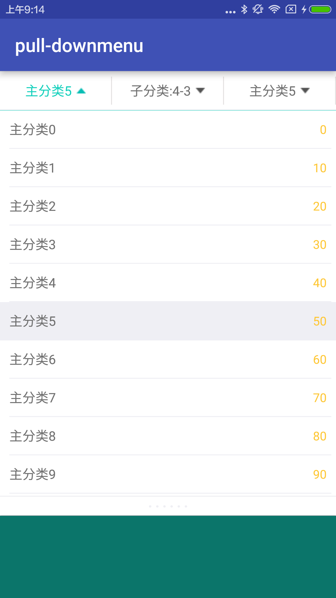
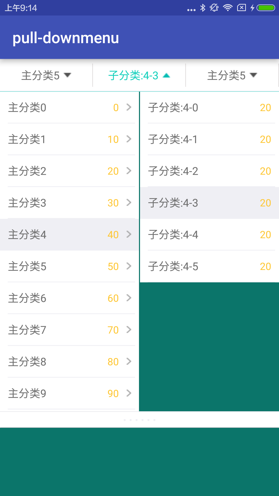

# PullDownMenu
An android pull-down menu library.

# Demo
<p>
   
</p>

<p>
   
</p>

<p>
   
</p>

# Usage

### Add dependency

```groovy
dependencies {
    compile 'com.yangchangfu:pull-downmenu-lib:1.0.0'
}
```

### Step 1

* add PullDownMenuView in layout xml

```xml
<com.yangchangfu.pull_downmenu_lib.PullDownMenuView
        android:id="@+id/pulldownmenu"
        android:layout_width="match_parent"
        android:layout_height="wrap_content"
        app:menuTotalColumn="3"/>
```

### Step 2

* create a list to add items.

```java
List<PullDownMenuItemData> list0 = new ArrayList<>();
for (int i=0; i<15; i++){
    PullDownMenuItemData data = new PullDownMenuItemData();
    data.id = "" + i;
    data.name = "主分类" + i;
    data.num = String.valueOf(10 * i);

    List<PullDownMenuItemData> itemList = new ArrayList<>();
    for (int j=0; j<6; j++){
        PullDownMenuItemData sub = new PullDownMenuItemData();
        sub.id = "" + i;
        sub.name = "子分类:" + i + "-" + j;
        sub.num = String.valueOf(5 * i);
        itemList.add(sub);
    }

    if (i % 2 == 0) {
        data.itemList = itemList;
    } 

    list0.add(data);
}
        
PullDownMenuView pullDownMenuView = (PullDownMenuView) findViewById(R.id.pulldownmenu);
pullDownMenuView.setMenuColumn(0, list0, 0);
pullDownMenuView.setMenuColumn(1, list0, 0, 0);
pullDownMenuView.setMenuColumn(2, list0, 0);
```

### Step 3

* listener item click event

```java
pullDownMenuView.setOnItemSelectListener(new PullDownMenuView.OnItemSelectListener() {
    @Override
    public void OnItemSelect(int column, int position, PullDownMenuItemData data1, int position2, PullDownMenuItemData data2) {
        System.out.println("----------------------------");
        System.out.println("column = " + column);
        System.out.println("position = " + position);
        System.out.println("data1 = " + data1.toString());
        System.out.println("position2 = " + position2);
        System.out.println("data2 = " + data2.toString());
    }
});
```

### Other

* open menu method for PullDownMenuView

```java
pullDownMenuView.setMenuColumn(0, list0, 0);
```
